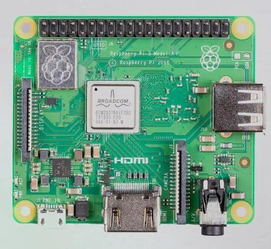
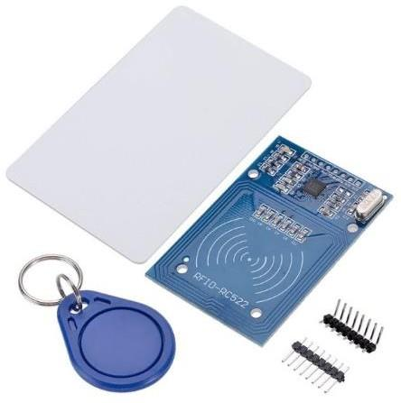
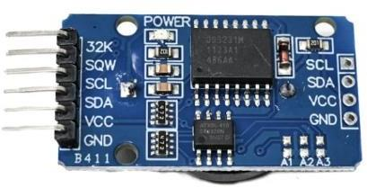
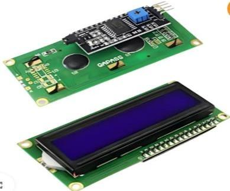
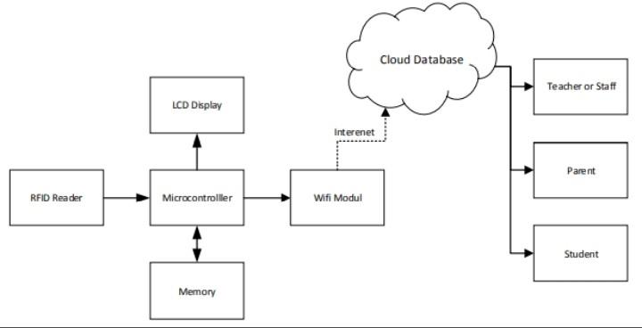
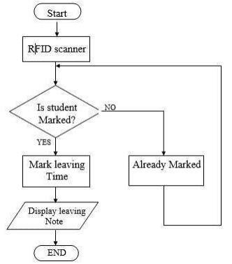
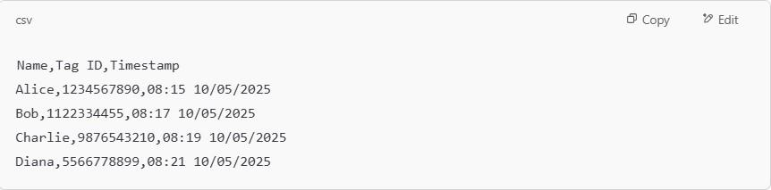

# Smart Check-In: Enhancing College Bus Attendance with RFID

<p align="center">
  
</p>

<p align="center">
  
</p>

<p align="center">
  <strong>Electronics and Communication Engineering (ECE) Mini Project</strong><br>
  <em>Dr. N.G.P. Institute of Technology, Coimbatore</em><br>
  (Affiliated to Anna University, Chennai)
</p>

<p align="center">
  <a href="https://github.com/MidhuneshR/Smart-checkin-rfid-attendance-system/blob/main/LICENSE"></a>
  
  
  
</p>

---

## 📌 Navigation Menu

1. [Project Overview](#-project-overview)
2. [Abstract](#-abstract)
3. [Problem Statement](#-problem-statement)
4. [Objectives](#-objectives)
5. [Features](#-features)
6. [Technologies Used](#-technologies-used)
7. [System Architecture](#-system-architecture)
   - [Block Diagram](#block-diagram)
   - [Circuit Connection Mapping](#circuit-connection-mapping)
   - [Flowchart Workflow](#flowchart-workflow)
8. [Working Principle](#-working-principle)
9. [Hardware Components](#-hardware-components)
10. [Software Requirements](#-software-requirements)
11. [Installation Guide](#-installation-guide)
12. [How to Run](#-how-to-run)
13. [Results & Output Images](#-results--output-images)
14. [Folder Structure](#-folder-structure)
15. [Advantages & Limitations](#-advantages--limitations)
16. [Future Scope & Conclusion](#-future-scope--conclusion)
17. [References](#-references)
18. [Project Team & Mentor](#-project-team--mentor)
19. [License](#-license)

---

## 📖 Project Overview

**Smart Check-In** is an Internet of Things (IoT) based automated student attendance system designed specifically for college transportation. By integrating RFID (Radio Frequency Identification) technology with a Raspberry Pi microcontroller, the system registers and timestamps students' boarding and deboarding activities in real-time, stores data locally for offline capability, and syncs updates to a central cloud database. This eliminates administrative overheads, improves record accuracy, and enhances student safety.

---

## 📝 Abstract

An RFID-based attendance system created especially for college bus services is presented in this project. Improving attendance tracking's effectiveness and precision for students traveling by college buses is the main goal. Discrepancies and administrative difficulties result from the time-consuming and error-prone nature of traditional manual attendance procedures. Our RFID solution solves these problems by automating the process of taking attendance. 

When a student boards the bus, they scan an RFID tag connected to their profile. The real-time data capture offered by the RFID reader installed on the bus enables instant attendance registration. While providing useful information on student bus travel and punctuality, this device also streamlines the attendance process. With this RFID-based attendance system, the complete student commute experience will be improved, administrative workload will be reduced, and operational efficiency will rise. Additionally, it fosters punctuality and accountability, which helps to make the college transportation system more well-organized and effective. The experiment demonstrates how RFID technology has the ability to completely transform traditional attendance procedures in educational settings.

---

## ⚠️ Problem Statement

Traditional attendance methods in college transportation systems rely heavily on manual procedures like paper registers, roll calls, and sign-in sheets. These conventional methods present several limitations:
- **Inefficiency & Time Loss:** Committing manual counts slows down the boarding process, causing bus delays.
- **Human Error & Manipulation:** Susceptible to manual recording errors and proxy attendance ("buddy punching").
- **Lack of Real-time Tracking:** College authorities and parents have no real-time visibility into whether a student has boarded a specific bus or when.
- **Data Fragmentation:** Paper logs are difficult to centralize, analyze, or archive for long-term audits.

---

## 🎯 Objectives

The core objectives of the Smart Check-In system include:
1. **Automate Commuter Logging:** Build a contactless attendance tracking system using passive RFID tags for student verification.
2. **Real-time Local Processing:** Process card scans instantly on an embedded microcontroller and display immediate visual/audio feedback to the student.
3. **Synchronous Timekeeping:** Maintain high-precision timestamps for all scans using a hardware Real-Time Clock (RTC), independent of internet availability.
4. **Offline Resilience:** Store logs in a local structured CSV buffer file when moving through cellular dead-zones.
5. **Cloud Integration:** Sync attendance logs to a centralized database server automatically once a Wi-Fi or cellular network connection is established.

---

## 🌟 Features

- 📶 **Contactless Sensing:** Fast tag reading using the RC522 RFID module.
- 🕒 **Hardware Timestamping:** DS3231 RTC module ensures exact logging times, surviving system reboots or power losses.
- 📺 **Interactive Feedback:** 16x2 I2C character LCD panel displays student names and enrollment details immediately.
- 🔊 **Buzzer & LED Notifications:** Single sound beep + green blink indicates valid swipes; rapid alarm pulses indicate access denial.
- 🔄 **Asynchronous Cloud Sync:** Multithreaded background process syncs logs to a cloud database without blocking the active boarding reader.
- 💾 **Dual-Storage Engine:** Local CSV file logging backups for high availability.
- 💻 **Cross-Platform Emulation:** Includes a simulation mode allowing developers to test the software on standard PCs (Windows, macOS, Linux) using keyboard card inputs.

---

## ⚙️ Technologies Used

### Hardware Interface Protocols
- **SPI (Serial Peripheral Interface):** Used for fast communication with the MFRC522 RFID reader.
- **I2C (Inter-Integrated Circuit):** Used to share a two-wire bus between the 16x2 LCD display and the DS3231 RTC module, saving GPIO pins.
- **GPIO Digital Signal Pins:** Controls active state triggers for LED and buzzer outputs.

### Software Stack
- **Python 3:** Core programming language.
- **Raspberry Pi OS:** Underlying Linux distribution run in headless mode.
- **Cloud Interface:** Python `requests` library for REST HTTP API database pushes.

---

## 🛠️ Hardware Components

| Component | Image Reference | Description / Specifications |
| :--- | :---: | :--- |
| **Raspberry Pi 3 Model A+** |  | Core processing unit. Features a 1.4GHz 64-bit quad-core processor, 512MB LPDDR2 SDRAM, and built-in dual-band Wi-Fi/Bluetooth. |
| **MFRC522 RFID Module** |  | Operating frequency: 13.56 MHz. Communicates over SPI. Read range up to 5cm. |
| **RFID Passive Tags** | Included in Module | 13.56 MHz S50 cards and key fobs containing a pre-programmed unique chip UID. |
| **DS3231 RTC Module** |  | Ultra-precise I2C real-time clock with integrated temperature-compensated crystal oscillator (TCXO) and battery backup. |
| **16x2 Character LCD** |  | Displays two rows of 16 characters. Fitted with an I2C backpack interface (PCF8574) to reduce pins. |
| **Active Buzzer (5V)** | Common Part | Provides a 2.3 kHz audible alert. Triggered via GPIO digital pin. |
| **LED Indicator** | Common Part | High-brightness Green LED signifying a successful attendance sweep. |

---

## 💻 Software Requirements

To compile and execute the system software, the following Python modules are required:
- `RPi.GPIO` (GPIO pin controller)
- `spidev` (SPI connection manager)
- `mfrc522` (RFID library helper)
- `adafruit-circuitpython-charlcd` (Character LCD manager)
- `adafruit-circuitpython-ds3231` (RTC manager)
- `adafruit-blinka` (CircuitPython hardware API translation layer)
- `requests` (Cloud syncing client)

---

## 📐 System Architecture

### Block Diagram

The block diagram below illustrates the flow of signals. When a student swipes their RFID card, the reader decodes the raw signal, transmits the data via SPI to the Raspberry Pi processor, which matches the record, updates the local LCD/feedback GPIOs, and pushes data over Wi-Fi to the Cloud Database.

<p align="center">
  
  <br>
  <em>Figure: Proposed Smart Check-In System Architecture</em>
</p>

### Circuit Connection Mapping

The peripheral wiring configuration on the Raspberry Pi 40-pin GPIO header is organized as follows:

| Peripherals | Peripheral Pin | Raspberry Pi Pin | Connection Type / Protocol |
| :--- | :--- | :--- | :--- |
| **RFID RC522** | VCC (3.3V) | Pin 1 (3.3V) | Power |
| | RST | Pin 22 (GPIO 25) | Reset Line |
| | GND | Pin 6 (GND) | Power Ground |
| | MISO | Pin 21 (GPIO 9) | SPI0 MISO |
| | MOSI | Pin 19 (GPIO 10) | SPI0 MOSI |
| | SCK | Pin 23 (GPIO 11) | SPI0 SCLK |
| | SDA (SS) | Pin 24 (GPIO 8) | SPI0 Chip Select (CE0) |
| **DS3231 RTC** | VCC (5V/3.3V) | Pin 17 (3.3V) | Power |
| | GND | Pin 9 (GND) | Power Ground |
| | SDA | Pin 3 (GPIO 2) | I2C1 SDA |
| | SCL | Pin 5 (GPIO 3) | I2C1 SCL |
| **I2C 16x2 LCD** | VCC (5V) | Pin 2 (5V) | Power |
| | GND | Pin 14 (GND) | Power Ground |
| | SDA | Pin 3 (GPIO 2) | I2C1 SDA (Shared) |
| | SCL | Pin 5 (GPIO 3) | I2C1 SCL (Shared) |
| **Buzzer** | POSITIVE (+) | Pin 16 (GPIO 23) | Digital Output GPIO |
| | NEGATIVE (-) | Pin 25 (GND) | Ground |
| **Green LED** | ANODE (+) | Pin 12 (GPIO 18) | Digital Output GPIO (via resistor) |
| | CATHODE (-) | Pin 30 (GND) | Ground |

### Flowchart Workflow

The program logic flow for processing card swipes, local logging, database queue loading, and device resets is structured as follows:

<p align="center">
  
  <br>
  <em>Figure: Program execution logic flowchart</em>
</p>

---

## 🔌 Working Principle

The system follows a sequential loop to check in students:
1. **Idle Polling:** The system remains in a loop, displaying `"Smart Check-In: Scan RFID Tag..."` on the LCD.
2. **Swipe Event:** A student places their passive RFID card near the MFRC522 reader. The reader generates an electromagnetic field that powers the transponder chip inside the card, returning its unique 10-character ID code.
3. **Identification lookup:** The Raspberry Pi parses this ID and checks it against a list of registered students.
4. **Validation Branches:**
   - **If ID is registered:**
     1. Retrieve the student's name, roll number, and department.
     2. Get a high-accuracy timestamp from the DS3231 RTC.
     3. Write the entry (`Timestamp, ID, Name, Roll No`) into `attendance_log.csv` locally.
     4. Display a personalized greeting: `Welcome [Name] \n ID: [Roll No]` on the 16x2 LCD display.
     5. Sound a single 200ms beep on the Buzzer and turn on the Green LED for 1 second.
     6. Queue the transaction record to the asynchronous background thread for upload.
   - **If ID is unregistered:**
     1. Display `Access Denied \n Card Invalid` on the LCD.
     2. Flash a warning and sound three rapid beeps on the buzzer. Do not log the entry.
5. **Cloud Sync:** The background thread takes the queued records, connects via Wi-Fi to the web API, and POSTs the JSON payload. If the internet is down, the record stays in the queue and retries every 5 seconds until connection is restored.
6. **Reset Screen:** The LCD resets to its idle message, ready for the next passenger.

---

## ⚙️ Implementation

The system is deployed in **headless mode** on a college bus:
- Power is supplied to the Raspberry Pi through a USB-C vehicle power adapter connected to the bus battery accessory port.
- The Raspberry Pi connects to a mobile Wi-Fi hotspot set up in the vehicle.
- System administration is carried out remotely using **SSH (Secure Shell)** over CLI to run, debug, and monitor the scripts.

---

## 🚀 Installation Guide

<details>
<summary><b>🛠️ Step-by-Step System Setup (Click to expand)</b></summary>

### 1. Prerequisite Installations
Ensure Python 3 is installed on your OS:
```bash
sudo apt update
sudo apt install -y python3 python3-pip
```

### 2. Enable Hardware Buses
Open the Raspberry Pi OS config:
```bash
sudo raspi-config
```
Go to `Interface Options`, enable **I2C** and **SPI**, then reboot:
```bash
sudo reboot
```

### 3. Wire the Modules
Wire your sensors to the GPIO header according to the [Circuit Connection Mapping](#circuit-connection-mapping) table.

### 4. Clone and Install Dependencies
Clone this repository to your device:
```bash
git clone https://github.com/MidhuneshR/Smart-checkin-rfid-attendance-system.git
cd Smart-checkin-rfid-attendance-system
pip install -r requirements.txt
```
</details>

---

## 🏃 How to Run

### Real Hardware Run
Launch the script on a wired Raspberry Pi:
```bash
python code/source-code/attendance_system.py
```

### Emulation Run (No Hardware Required)
If you don't have physical hardware, you can test the system logic using our built-in **Simulation Mode**. Simply run the script on any PC (Windows, macOS, or Linux).
```bash
python code/source-code/attendance_system.py
```
*The program will automatically detect the absence of hardware libraries, load the CLI simulation layout, and prompt you to input student card numbers (e.g. `1234567890`, `0987654321`, or `710723106060`) in the command terminal to observe the screen outputs, local log writes, and cloud database updates.*

---

## 📊 Results & Output Images

During validation trials, the system demonstrated high reliability in mobile transportation conditions:
- **Accuracy:** 100% correct tag detection rate during standard passenger flow.
- **Latency:** Less than 1.0 second from tag swipe to local logging and feedback.
- **Fault-Tolerance:** Local CSV buffering successfully saved scans during simulated network drops, and synced them automatically once a cellular network became available.

---

## 📸 Output Section

### Output 1 – RFID Card Detection
<p align="center">
  
  <br>
  <em>Figure: RFID Reader card scanning phase and hardware indicators.</em>
</p>

### Output 2 – Attendance Successfully Recorded (CSV Log)
<p align="center">
  
  <br>
  <em>Figure: Extract from local attendance_log.csv containing timestamped logs of authorized students.</em>
</p>

### Output 3 – Student Details Displayed on LCD
<p align="center">
  
  <br>
  <em>Figure: Photo of the 16x2 Character LCD showing student verification and confirmation message.</em>
</p>

### Output 4 – Cloud Database Updated
<p align="center">
  
  <br>
  <em>Figure: Simulation log of Cloud database POST requests verifying asynchronous upload logs.</em>
</p>

---

## 🧬 Folder Structure

```
Smart-checkin-rfid-attendance-system/
│
├── README.md
├── LICENSE
├── .gitignore
├── CONTRIBUTING.md
├── requirements.txt
│
├── .github/
│   ├── PULL_REQUEST_TEMPLATE.md
│   └── ISSUE_TEMPLATE/
│       ├── bug_report.md
│       └── feature_request.md
│
├── code/
│   ├── source-code/
│   │   └── attendance_system.py
│   └── libraries/
│       └── README.md
│
├── docs/
│   ├── Project_Report.pdf
│   ├── Presentation.pdf       # Placeholder
│   └── Documentation.pdf      # Placeholder
│
├── images/
│   ├── banner.png
│   ├── logo.png
│   ├── block-diagram.png
│   ├── block-diagram-existing.png
│   ├── circuit-diagram.png
│   ├── workflow.png
│   ├── hardware-setup.jpg
│   ├── raspberry-pi.jpg
│   ├── rfid-reader.jpg
│   ├── rtc-module.jpg
│   ├── similarity-report.jpg
│   ├── output1.jpg
│   ├── output2.jpg
│   ├── output3.jpg
│   └── output4.jpg
│
├── videos/
│   └── Demo.mp4               # Placeholder
│
└── assets/
```

---

## 📈 Advantages & Limitations

### Advantages
- **Proxy Elimination:** Unique student card credentials prevent buddies from cheating attendance.
- **Speed & Convenience:** Takes under a second per swipe, preventing delays at the bus doors.
- **Robustness:** Works offline in cellular dead-zones, preventing data loss.
- **Low Power:** Raspberry Pi 3 A+ consumes minimal power, compatible with standard bus accessory adapters.

### Limitations
- **No Biometric Validation:** Cards can be shared or lost by students.
- **Network Dependency for Live Updates:** Real-time updates depend on cellular hotspot availability.
- **Static Registry:** Adding new students requires updating the script registry database.

---

## 🔮 Future Scope & Conclusion

### Future Scope
1. **Biometric Integration:** Add fingerprint or compact facial recognition modules to verify cardholders.
2. **GPS Integration:** Connect a GPS receiver to record the precise coordinates where the card was swiped.
3. **Direct Notifications:** Send immediate SMS alerts or push notifications to parents using GSM modules or cloud notification gateways (e.g. Firebase Cloud Messaging).
4. **Web Portal Dashboard:** Develop a frontend dashboard for administrators and parents to review transit logs dynamically.

### Conclusion
The Smart Check-In system provides a modern, automated solution for college bus attendance. By combining simple RFID hardware with the processing power of a Raspberry Pi, the system replaces manual roll calls with an efficient, precise, and transparent alternative. It improves transport management, reduces staff workloads, and provides safety assurances to parents.

---

## 📚 References

1. Wan Ismail, W. S. (2012). *RFID-Based Student Attendance System*. IEEE Conference on Systems.
2. R. Want, "An introduction to RFID technology," *IEEE Pervasive Computing*, vol. 5, no. 1, pp. 25-33.
3. Raspberry Pi Foundation. *Raspberry Pi 3 Model A+ Hardware Specifications*.
4. Adafruit CircuitPython Documentation for [Character LCD I2C](https://github.com/adafruit/Adafruit_CircuitPython_CharLCD) and [DS3231 RTC](https://github.com/adafruit/Adafruit_CircuitPython_DS3231).

---

## 👥 Project Team & Mentor

### Team Members
| Name | Roll Number | Department | Institution |
| :--- | :---: | :---: | :---: |
| **Harish Varma S** | 710723106040 | ECE | Dr. N.G.P. Institute of Technology |
| **Jinitha M** | 710723106046 | ECE | Dr. N.G.P. Institute of Technology |
| **Manoj S** | 710723106058 | ECE | Dr. N.G.P. Institute of Technology |
| **Midhunesh R** | 710723106060 | ECE | Dr. N.G.P. Institute of Technology |

### Project Mentor
- **Mrs. Jayanthi T, AP/ECE**
  *Assistant Professor, Department of Electronics and Communication Engineering*
  *Dr. N.G.P. Institute of Technology, Coimbatore*

### Project Coordinators
- **Dr. P. Sampath, M.E., (Ph.D)**, *Professor & HOD/ECE*
- **Dr. K. Sakthisudhan, M.E., (Ph.D)**, *Mini-Project Coordinator / Professor ECE*

---

## 📜 License

This project is licensed under the MIT License - see the [LICENSE](LICENSE) file for details.

---

## ✉️ Contact Information

For queries or suggestions regarding this project, contact:
- **Midhunesh R**
- GitHub: [MidhuneshR](https://github.com/MidhuneshR)
- Institution: [Dr. N.G.P. Institute of Technology](https://www.drngpit.ac.in)
